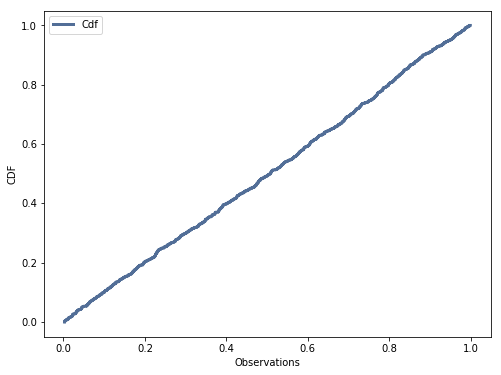
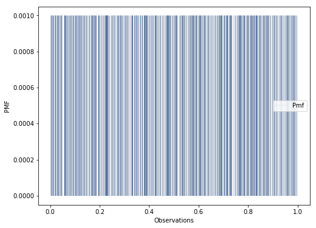

[Think Stats Chapter 4 Exercise 2](http://greenteapress.com/thinkstats2/html/thinkstats2005.html#toc41) (a random distribution)

Considering the CDF, which is quite close to a straight line, the distribution is indeed uniform.

Furthermore, the PMF shows equal probability for all values in the sample.

